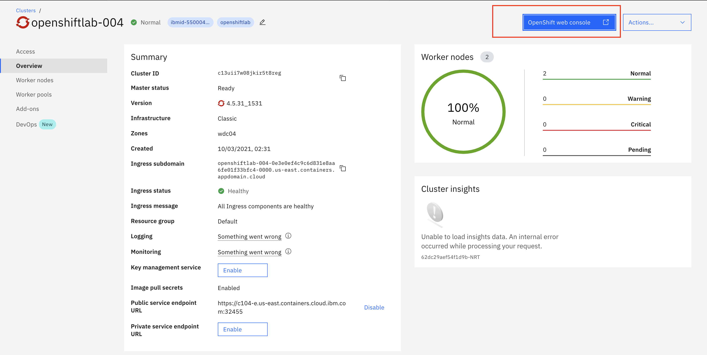
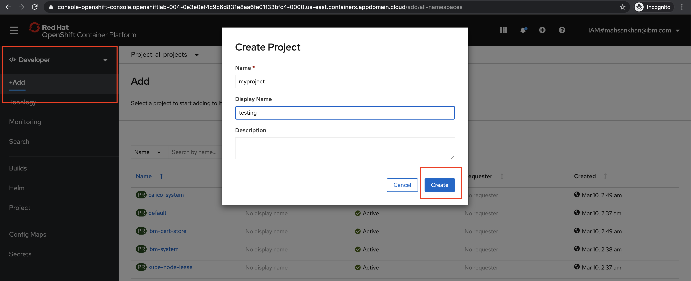
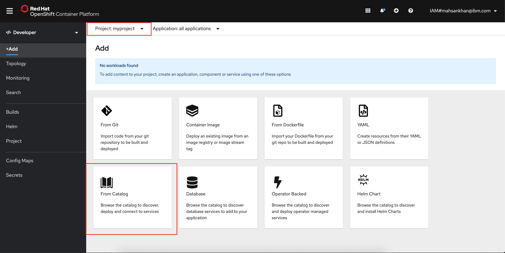
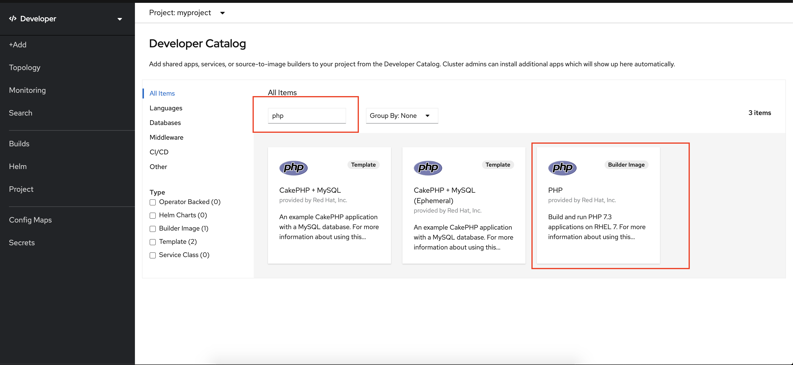
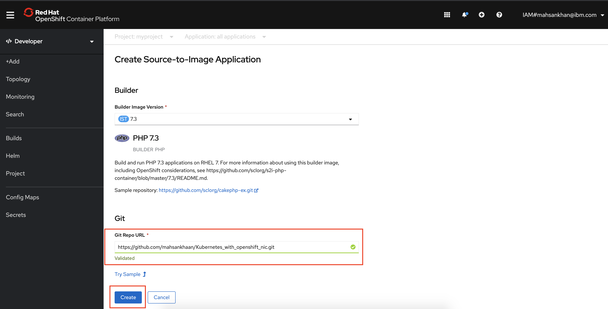

# Kubernetes_with_openshift@NIC
Let's deploy simple php application on Openshift cluster

## Follow these steps:

## Step 1 : Sign-up for IBM Cloud Platform 

[http://ibm.biz/openshiftnic](http://ibm.biz/openshiftnic)

## Step 2: Get RedHat OpenShift cluster:
[https://openshiftlab.mybluemix.net]( https://openshiftlab.mybluemix.net)
1. lab_Key:oslab
2. IBM_id: your email 

## Step 3: You will see below image once you are successfully registered

## Step 4: Login into your IBM account and you will able to see external account then select it

## Step 5 : Go to resources and the see your cluster must be there

## Step 6: Select the cluster and open web console

## Step 7: On web console you will able to see openshift dashboard ,next select create project

### NOTE: Make sure you are under Developer mode

## Step 8: Get into your newly created project and select Catalog

## Step 9: Search for php and select PHP builder image

## Step 10: In Configuration
1. Application name : phpapp
2. Git Repository: [https://github.com/mahsankhaan/Kubernetes_with_openshift_nic.git](https://github.com/mahsankhaan/Kubernetes_with_openshift_nic.git) 

## Step 11: Check Build process (Optional)
1. Select Builds from left menu
1. Select the build __phpapp__
1. Under __Builds__,select -> __phpapp-1__  -> logs

## Step 12: Access the application
1. Select __Topology__

## Step 13: Finally your application is running on Openshift

