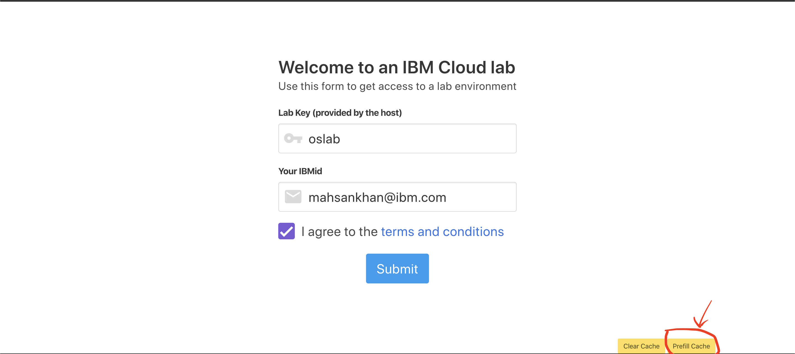
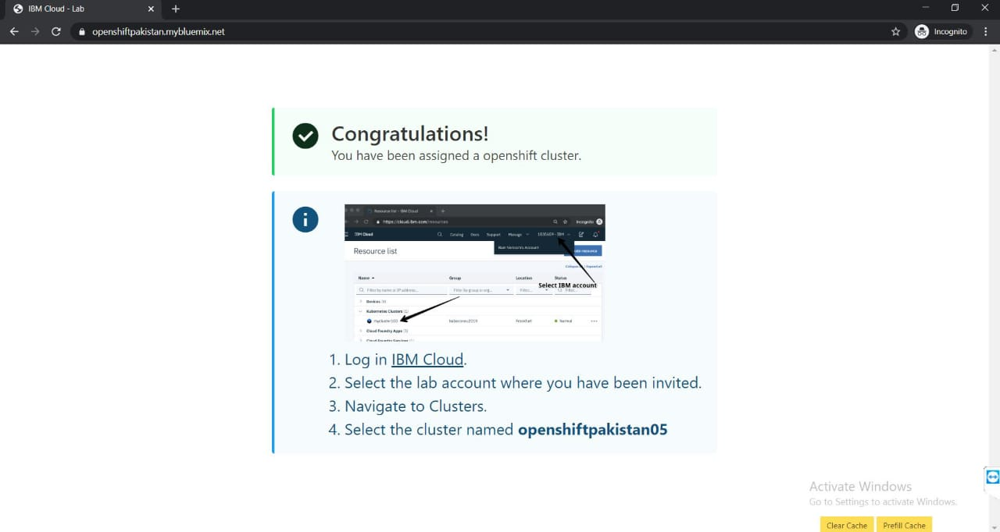

# Kubernetes_with_openshift@NIC
Let's deploy simple php application on Openshift cluster

## Follow these steps:

## Step 1 : Sign-up for IBM Cloud Platform 

[http://ibm.biz/openshiftnic](http://ibm.biz/openshiftnic)

## Step 2: Get your Openshift cluster:
[https://openshiftpakistan.mybluemix.net/](https://openshiftpakistan.mybluemix.net/)
1. lab_Key:oslab
2. IBM_id: your email 

## Step 3: Please be sure to click: Prefill Cache button on the URL before submit

## Step 4: You will see below image once you are successfully registered

## Step 5: Login into your IBM account and you will able to see external account then select it

## Step 6 : Go to resources and the see your cluster must be there

## Step 7: Select the cluster and open web console

## Step 8: On web console you will able to see openshift dashboard ,next select create project

